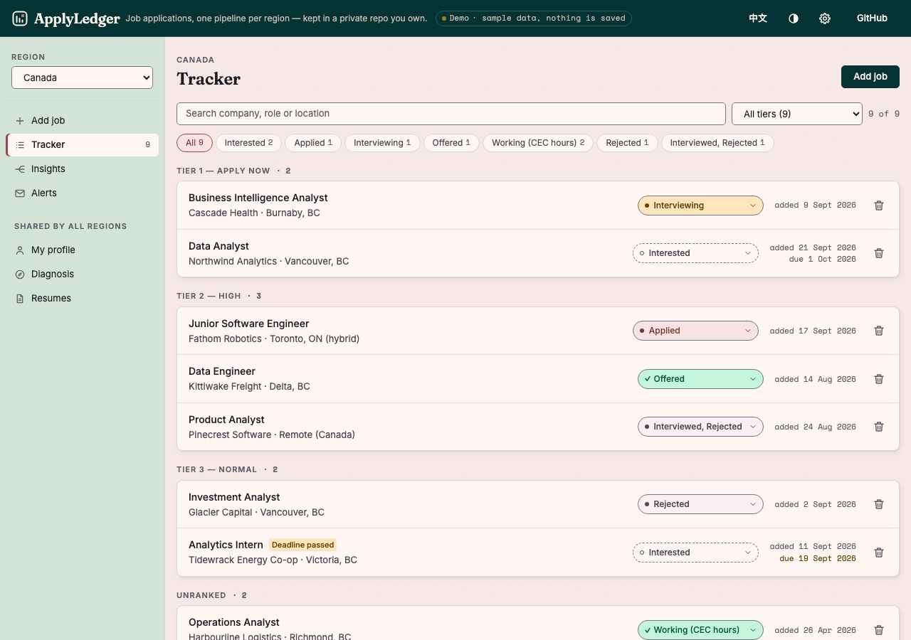
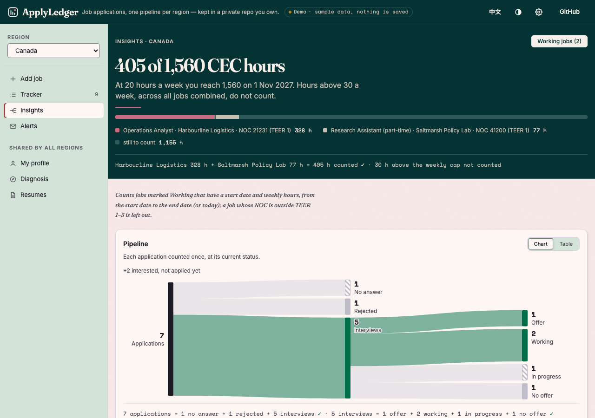

# Job Application Command Center

A single-file job-search tracker for people applying across several countries at once. Every
region (Canada, US, UK, Hong Kong, Mainland China, …) keeps its own pipeline and its own tailored
documents; profile, resume library and glossary are shared. The app is one HTML file — React 18
from a CDN, compiled in the browser — and stores everything in a **private GitHub repo you own**.

**Live demo:** https://nickkklian.github.io/Job-Tracker/?demo=1&tab=tracker (or `&tab=insights`) —
sample data, nothing is saved. English by default, 中文 toggle in the header.



## What's in it

| Tab | What it does |
|---|---|
| **Add Job** | Paste or upload a job description (`.txt/.md/.docx/.pdf`); role, company, location, salary and deadline are extracted heuristically and pre-filled for review. Tier (T1–T4), NOC code, employment type and weekly hours live on the same form |
| **Tracker** | Filter by status and tier, search, open a job. Each job gets prompt generators for a tailored resume, cover letter, interview prep, networking plan and JD analysis — copied into Claude.ai, no API key required — plus PDF slots that sync to the repo |
| **My Profile** | Sectioned profile (upload files or insert a skeleton / per-role skills blocks), a translation glossary, and formatting rules that are injected into every resume prompt |
| **Diagnosis** | A six-step pre-application check: stage → strengths → target profile → reality check against real JDs → resume narrative → high-stakes decisions |
| **Resumes** | A library of resume versions with preview, rename, download and "use as profile" |
| **Insights** | A Sankey of the pipeline, response and offer rates, upcoming deadlines — and a **CEC hours ledger** (see below) |
| **Alerts** | Optional, needs an Anthropic key: paste a LinkedIn job-alert email, Claude looks up each posting on the company's career page, scores it against your profile, and the ones you tick go straight into the tracker |



### The CEC hours ledger

Canadian Experience Class counts skilled work hours toward 1,560, and IRCC's 30-hours-per-week cap
applies **across all jobs combined**, not per job. The ledger therefore slices time by week, sums
every active job's hours for that week, caps the total at 30, and attributes the capped hours back
proportionally — so two 25-hour jobs count as 30, not 50. It also refuses to count jobs whose NOC
code isn't TEER 1–3 or whose employment type is missing (contractor hours don't count), and shows
an ETA to the target at the current weekly rate.

### Batch tailoring (optional, needs an Anthropic key)

For every "Interested" job with a JD, one API call returns the tailored resume as **structured
JSON** (sections → entries → bullets); a small jsPDF renderer lays it out as a one-page Letter PDF
with the same column geometry the Claude.ai prompts specify. Results are cached locally and pushed
to the repo.

## How it's built

| Concern | Approach |
|---|---|
| Runtime | One `index.html`: React 18 + ReactDOM from cdnjs, JSX compiled in the browser by Babel standalone, Tailwind via CDN. No build step, nothing to install |
| Storage | GitHub Contents API against a private repo. Each write re-reads the blob SHA on a 409 and retries once, so two devices can edit without clobbering each other |
| Files | PDFs are stored as raw base64 under `data/files/` and cached in localStorage for instant preview; on a new device they're pulled from the repo on first open |
| JD parsing | Regex heuristics over the first 80 cleaned lines (noise such as contact lines, EEO boilerplate and URLs is stripped first); the raw JD is always stored unmodified |
| Prompts | Long, explicit reportlab instructions (column widths, table styles, one-page enforcement, a banned-word list for junior résumés) so Claude.ai's Analysis tool produces a consistent PDF every time |
| Secrets | GitHub token and Anthropic key live only in this browser's localStorage |
| Language | English by default, 中文 via the toggle; stored ids and prompt templates are never translated |

## Running it

Open `index.html` from any static server (it fetches its libraries from CDNs, so a network
connection is required):

```bash
python3 -m http.server 8732        # then http://localhost:8732/?demo=1&tab=tracker
```

To use it for real, create a private repo, generate a classic token with the `repo` scope, and
enter both in ⚙️ Settings. The optional features (Batch Tailor, Alerts) take an Anthropic API key in
the same panel.

## Limitations

- Compiling JSX in the browser costs ~1–2 s on first paint; fine for a personal tool, not a pattern
  for a product.
- Calling the Anthropic API from the browser requires the `anthropic-dangerous-direct-browser-access`
  header; the key never leaves your machine, but this is a single-user trade-off.
- The JD extractor is heuristic and tuned for English postings; it pre-fills, you verify.

## License

MIT.
