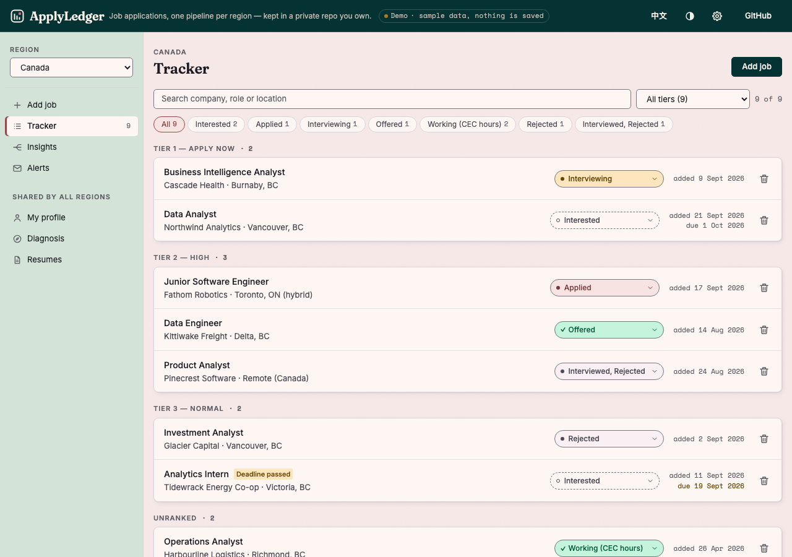
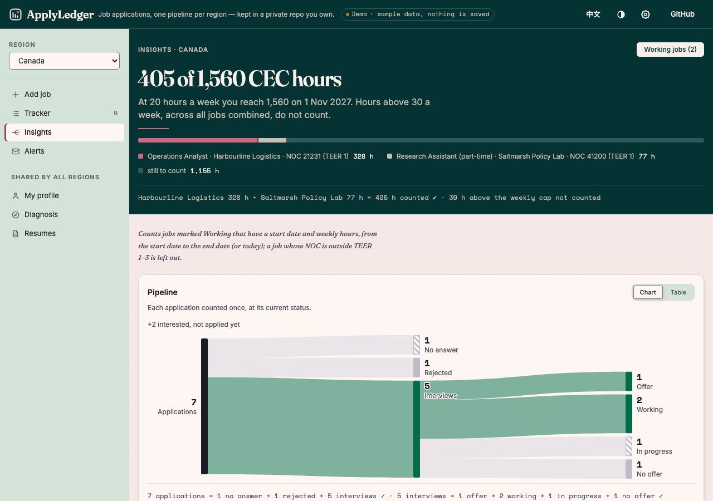
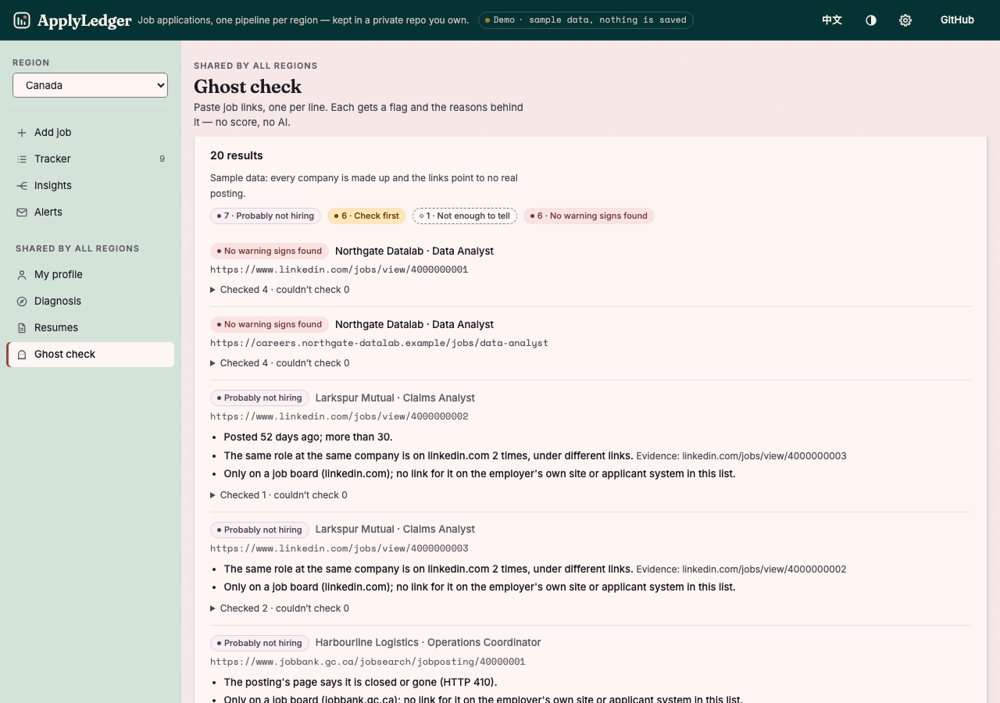

# ApplyLedger


A job-application tracker for people applying in several countries at once. Every region (Canada, US, UK,
Hong Kong, Mainland China, …) keeps its own pipeline and its own tailored documents; your profile, resume library
and glossary are shared. The app is one HTML file — React 18, compiled ahead of time, with every library served from
this repository — and keeps everything in a **private GitHub repo you own**.

**Live demo:** https://nickkklian.github.io/Job-Tracker/?demo=1&tab=tracker (or `&tab=insights`; add `&region=usa`
to open another region) — sample data, nothing is saved. English by default, 中文 in the top bar.

## Try it

**In the browser, nothing to install:** [the Ghost check on 20 made-up postings](https://nickkklian.github.io/Job-Tracker/?demo=1&tab=ghost),
or [the tracker with sample data](https://nickkklian.github.io/Job-Tracker/?demo=1&tab=tracker).

**From a clone, one command** (Node, nothing to install, no network):

```bash
node ghost-check.mjs examples/ghost-links.txt
```

[`examples/ghost-links.txt`](examples/ghost-links.txt) holds four made-up postings. Three lines give the link and what
the posting says (company, title, posted date); the fourth is a link on its own. This is what comes back:

```
PROBABLY NOT HIRING  https://www.linkedin.com/jobs/view/4000000002
  x Posted 52 days ago; more than 30.
  x Only on a job board (linkedin.com); no link for it on the employer's own site or applicant system in this list.
  . Only one link for this role on linkedin.com in this list.
  ? Not checked whether the posting is still up (run ghost-check.mjs --live).
CHECK FIRST  https://www.indeed.com/viewjob?jk=a1b2c3d4e5f60001
  x Only on a job board (indeed.com); no link for it on the employer's own site or applicant system in this list.
  . Posted 12 days ago.
  . Only one link for this role on indeed.com in this list.
  ? Not checked whether the posting is still up (run ghost-check.mjs --live).
NO WARNING SIGNS FOUND  https://boards.greenhouse.io/quillworks/jobs/5000001
  . Posted 6 days ago.
  . Only one link for this role on boards.greenhouse.io in this list.
  . On the employer's applicant system (boards.greenhouse.io).
  ? Not checked whether the posting is still up (run ghost-check.mjs --live).
NOT ENOUGH TO TELL  https://www.linkedin.com/jobs/view/4000000007
  ? Not checked whether the posting is still up (run ghost-check.mjs --live).
  ? Posting date unknown.
  ? Company or title unknown, so reposts cannot be matched.
  ? Company unknown, so the employer's own site cannot be matched.

4 lines: 1 probably not hiring, 1 check first, 1 no warning signs found, 1 not enough to tell, 0 unreadable
1 line was a link with nothing after it. Nothing is opened without --live, so the rules had nothing to read: add " | company: … | title: … | posted: …" after the link (the posting date matters most), or run with --live to see which postings are closed.
```

The check reads what you write after each link. It does not open the link, so a link on its own always comes back
*not enough to tell*. The rules and their limits are under [Ghost check](#ghost-check-is-anyone-actually-hiring).



## What's in it

The navigation has two groups: the views that belong to the region you are in, and the ones every region shares.

| View | What it does |
|---|---|
| **Add job** | Paste a job description or upload one (`.txt/.md/.docx/.pdf`). An upload fills the empty fields — company, role, location, salary, deadline — from the text, heuristically; for pasted text, *Fill fields from the description* does the same. You check them before saving. Tier (T1–T4) and status are on the same form, and in Canada so are the five fields the hours ledger reads |
| **Tracker** | Applications grouped by tier, with a search box and status filters that show their counts; the status is a control you change in place. Opening a job gives prompt generators for a tailored resume, cover letter, interview prep, networking plan and job-description analysis — copied into Claude.ai, no API key needed — the same kind of prompt for translating a resume into Simplified or Traditional Chinese, and PDF slots that sync to the repo |
| **Insights** | Where every application stands: a pipeline chart (or the same numbers as a table) whose parts add up to the whole, response and offer rates, upcoming deadlines and the companies you applied to most. In Canada it opens with the **CEC hours ledger** (below) |
| **Alerts** | Optional, needs an Anthropic key: paste a LinkedIn job-alert email; Claude looks up each posting on the company's careers page and scores it against your profile, and the ones you tick go into the tracker. *Discover new jobs* has Claude run up to five web searches for postings from the last 24 hours that fit your profile and score them the same way. It searches the region picked at the top: each of the twelve regions names its own place and main cities in the search (Remote / Global asks for fully remote roles open to any country) |
| **My profile** | A sectioned profile (upload files, or start from a skeleton and per-role skills blocks), a translation glossary, and formatting rules that go into every resume prompt |
| **Diagnosis** | A six-step check before applying: stage → strengths → target profile → reality check against real postings → resume narrative → high-stakes decisions |
| **Resumes** | A library of resume versions: preview, rename, download, delete, or use one as your profile |
| **Ghost check** | One line per posting: the link, then what the posting says (company, title, posted date). Each line gets *probably not hiring*, *check first*, *not enough to tell* or *no warning signs found*, with the reasons and the evidence behind it. A link on its own comes back *not enough to tell*, because the page does not open links. No score, no AI, no account needed (below) |



### Canada: the CEC hours ledger

The Canadian Experience Class counts skilled work hours toward 1,560, and IRCC's 30-hours-a-week cap applies
**across all jobs combined**, not per job. The ledger therefore slices time by week, sums every working job's hours
for that week, caps the total at 30 and gives the capped hours back to each job in proportion — so two 25-hour jobs
count as 30, not 50. It leaves out jobs whose NOC code isn't TEER 1–3 (a job with no NOC code yet is treated as
TEER 2), warns about working jobs with no employment type recorded, since contractor hours don't count, and shows
the date you reach 1,560 at the current weekly rate.

### Batch tailoring (optional, needs an Anthropic key)

For every "Interested" job with a JD, one API call returns the tailored resume as **structured
JSON** (sections → entries → bullets); a small jsPDF renderer lays it out as a one-page Letter PDF
with the same column geometry the Claude.ai prompts specify. Results are pushed to the repo and
cached locally. A job whose resume is already in the repo is skipped before any API call, so a run in
another browser never replaces it; to tailor that job again, delete its resume first.

### Ghost check: is anyone actually hiring?

Some postings stay up long after the job is gone, or were never meant to be filled. The Ghost check gives each posting
you list a flag and says why, in plain words. There is no score and no model: four rules, each of which either fires with the
evidence it saw or says what it could not check.

**Demo:** https://nickkklian.github.io/Job-Tracker/?demo=1&tab=ghost opens it with 20 made-up postings: 7 come out
*probably not hiring*, 6 *check first*, 1 *not enough to tell*, 6 *no warning signs found*.



**What to paste.** One line per posting: the link first, then what the posting says, as `company:`, `title:`, `posted:`
(a date or "12 days ago") and `live:`, separated by ` | `. The rules read these fields, not the page behind the link:
with the link alone none of them can look, and the flag is *not enough to tell*. Give at least the posting date;
company and title let the repost rule and the employer-site rule look. An applicant-system link (Greenhouse, Lever,
Workday, Ashby, …) already carries the company name, and so does a LinkedIn link of the long form
(`…/jobs/view/data-analyst-at-northgate-datalab-4000000001`).

```
https://www.linkedin.com/jobs/view/4000000002 | company: Larkspur Mutual | title: Claims Analyst | posted: 52 days ago
```

That line comes back *probably not hiring*: posted 52 days ago, and only on a job board. The same link with nothing
after it comes back *not enough to tell* ([both are in the example above](#try-it)).

**What it checks**

| Rule | Fires when | Evidence shown |
|---|---|---|
| Liveness | the posting's page says it is closed or gone (HTTP 404/410, Job Bank's expired page, LinkedIn's "No longer accepting applications", "position has been filled" and similar) | the status or the words found |
| Age | it was posted more than 30 days ago | the number of days and the date |
| Repost | the same company and title appear more than once on the same site, under different links | the other links |
| Not on the employer's site | it is only on a job board (LinkedIn, Indeed, Job Bank, Glassdoor, …) and the list has no link for it on the employer's own site or applicant system | the board it was found on |

Liveness alone makes *probably not hiring*; so do any two of the other three. One makes *check first*. When three or
four rules could not look (no date, no company, not checked), the flag is *not enough to tell*, never a clean bill.
The 30 days and the two-of-three are choices, not numbers learned from data. Age and repost follow two of the
posting-behaviour features (posting lifecycle, repost rate) in
[Vacancy Signal](https://github.com/NickkkLian/Ghost-Job-Detection-And-Trading-Signal), which studied ghost posting
across whole firms rather than single postings. The Job Bank and LinkedIn liveness markers come from an earlier checker
that was run on real postings after they came down; the markers for other sites have only been tested on made-up pages.

**What it can't know**

- What the employer intends. A flag says the posting *looks* abandoned; a role can still be real, and a fresh posting on
  the employer's own site can still be a formality or already promised to someone.
- Whether a job board's date is right: boards refresh dates, so "posted 3 days ago" may be a repost it did not show.
- Anything outside the list you paste: *not on the employer's site* means no such link was in the list, not that the
  rule searched the employer's site.
- Liveness, from the page. A browser page may not read other sites' pages, so the page never opens the links. To check
  them, run the same rules from the command line, which also opens each posting once (1.5 s apart) and prints the lines
  with a `live:` field to paste back:

```bash
node ghost-check.mjs links.txt --live     # or without --live: the rules only, no network
```

`--live` answers one question, whether the page says the posting is closed. It does not read the posting date or the
company off the page, so a bare link that is still up stays *not enough to tell*. A page that is still up proves nothing
either way, and LinkedIn is read through its public guest view, which can change without notice.

## How it's built

| Concern | Approach |
|---|---|
| Runtime | One `index.html`, built from `src/` by `build.mjs`: the JSX is compiled ahead of time with esbuild (pinned) and inlined. React 18, ReactDOM, mammoth, jsPDF and pdf.js (loaded the first time a `.pdf` is read) are served from `vendor/` (sources and hashes in `vendor/SOURCE.md`; CI fails if a file there does not match its hash); the styles are plain CSS (`app.css`) on the family's design tokens (`design-tokens.css`), with light/dark and three palettes from `appearance.js`. CI rebuilds the page and fails if it differs from the committed one. It also fails on every way of loading a script from another host that `check-scripts.mjs` lists at its top, among them a `<script>` whose `src` is not a path in this repository (in any case, quoting, spacing or line breaks, with character references, or written inside a string in the code), a `<base href>`, a `<link>` that preloads a script, an import map, `import()`, `importScripts`, workers or a `src` set in code unless the address is a plain path, code that runs text as code (`eval`, `Function`), and any address ending in `.js` or `.mjs`. It reads `index.html` and the page's own scripts outside `vendor/`, after a self-test that catches one sample of each form and passes the real page. Ways a static check cannot see, such as code text held in a variable and given to `setTimeout`, or names built while the page runs, are stopped by the browser instead: the page's Content-Security-Policy (written by `build.mjs`) lets scripts come only from this site and from the page's own inline scripts by their sha256, with no `'unsafe-eval'`, so text run as code and scripts from other hosts are refused while the page runs. `check-scripts.mjs` fails CI if that policy is missing, moved after a script, or loosened in any way |
| Storage | GitHub Contents API against a private repo. Each write sends the file's last known SHA; if the file changed since (another tab or device saved first, GitHub answers 409), it reads the file again and merges: what changed on one side only is kept from both, and when both sides changed the same value it asks which to keep. A page that never read a file does not write over it |
| Files | PDFs are stored as raw base64 under `data/files/` and cached in localStorage for instant preview; on a new device they're pulled from the repo on first open |
| JD parsing | Regex heuristics over the first 80 cleaned lines (noise such as contact lines, EEO boilerplate and URLs is stripped first); the raw JD is always stored unmodified |
| Prompts | Long, explicit reportlab instructions (column widths, table styles, one-page enforcement, a banned-word list for junior résumés) so Claude.ai's Analysis tool produces a consistent PDF every time |
| Secrets | GitHub token and Anthropic key live only in this browser's localStorage |
| Language | English by default, 中文 via the top bar; stored ids and prompt templates are never translated |

## Running it

Open `index.html` from any static server — every script the page uses is in this repository, including pdf.js
for reading `.pdf` job descriptions. To serve it locally:

```bash
python3 -m http.server 8732        # then http://localhost:8732/?demo=1&tab=tracker
```

To change it, edit `src/app.jsx` (the app) or `src/index.template.html` (the page around it), install the one
build dependency with `npm install` (esbuild 0.27.7), then:

```bash
node build.mjs            # writes index.html
node build.mjs --check    # what CI runs: index.html must be exactly what src/ builds to, and vendor/ match its hashes
node check-scripts.mjs    # CI too: no script from another host, and the page's script policy intact (--self-test: each form and each loosened policy is caught)
node check-models.mjs     # CI too: the page asks for Claude Opus 5.5 or Sonnet 5.5 only, with max_tokens >= 16000, and reads replies by block type (--self-test: each rule is caught)
node --test test/ghost-flags.test.mjs   # CI too: the Ghost check's rules (src/ghost-flags.js, which build.mjs puts in front of the app)
node ghost-mutants.mjs    # CI too: breaks each rule in a copy, one at a time; a test must fail for every break
```

A link can open a region: `?region=usa` (the ids are the `REGIONS` list in `src/app.jsx`); the region picker still
changes it.

To use it for real, create a private repo, generate a classic token with the `repo` scope, and
enter both in Settings (the gear in the top bar). The optional features (Batch Tailor, Alerts) take an Anthropic
API key in the same dialog.

## Limitations

- Calling the Anthropic API from the browser requires the `anthropic-dangerous-direct-browser-access`
  header. The key is stored only in this browser and sent only to Anthropic's API, which suits one person's own copy
  but not a shared deployment.
- The JD extractor is heuristic and tuned for English postings; it fills, you check.

## License

MIT.
